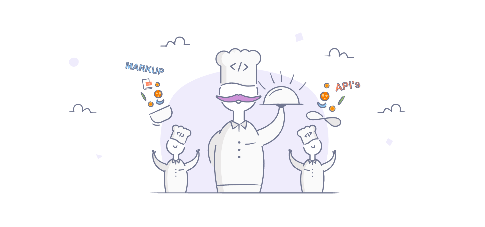

### Chapter Frontend 2.0

Que onda chavos? Ya tenemos fecha para el Chapter FrontEnd, va a ser el martes 18 de junio a la hora de la comida. Paco se va a discutir con las pizzas para que no haya excusa.



```js
import PropTypes from "prop-types"
import React from "react"

const Header = ({ siteTitle }) => (
  <header>
    Lorem, ipsum dolor sit amet consectetur adipisicing elit. Tempora libero
    perspiciatis doloribus illum suscipit voluptatem voluptatibus officiis
    reiciendis esse a! Recusandae nihil aperiam odit debitis consequatur ipsam
    molestiae, sapiente at.
  </header>
)

Header.propTypes = {
  siteTitle: PropTypes.string,
}

Header.defaultProps = {
  siteTitle: ``,
}

export default Header
```
